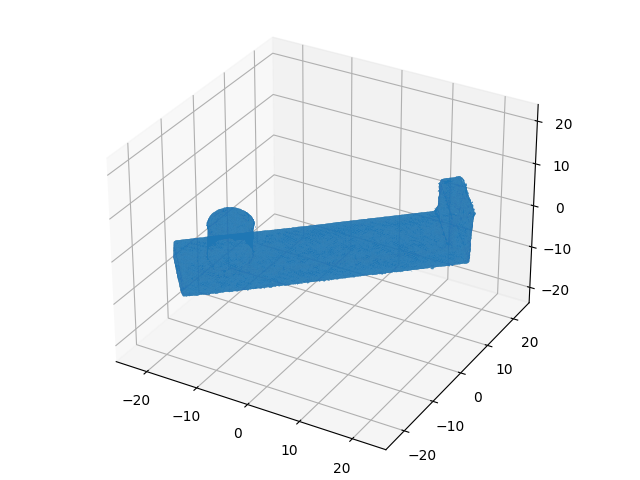
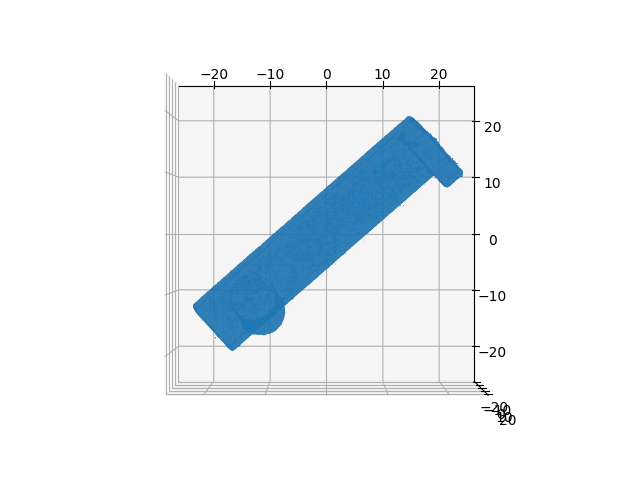
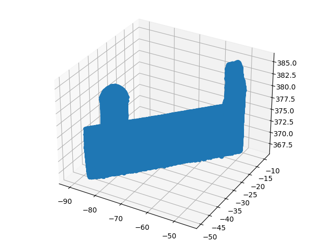

CLIENT FILES DOCUMENTATIONS
====================

CStlProcessing.py
---------------------

This file allows the user to load and graph a .stl.  

Install the following libraries:
1. numpy
2. matplotlib
3. mpl_toolkits
4. stl

To install stl:  

    pip install numpy-stl

To process any __stl__, specify the .stl path in the variable *path*.

###Expected Output:
1. A 3D Model with an isometric view:  

2. A 3D Model with a defined view:  

3. A scatter plot of all the data cloud read from the .stl:  
  